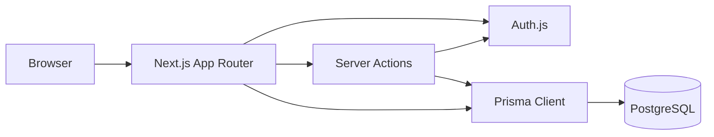
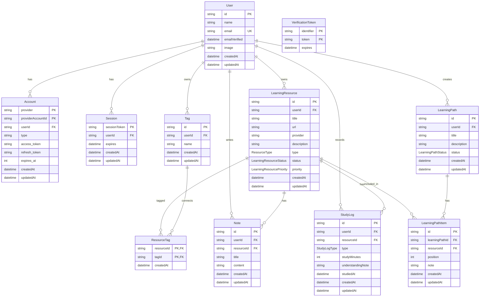
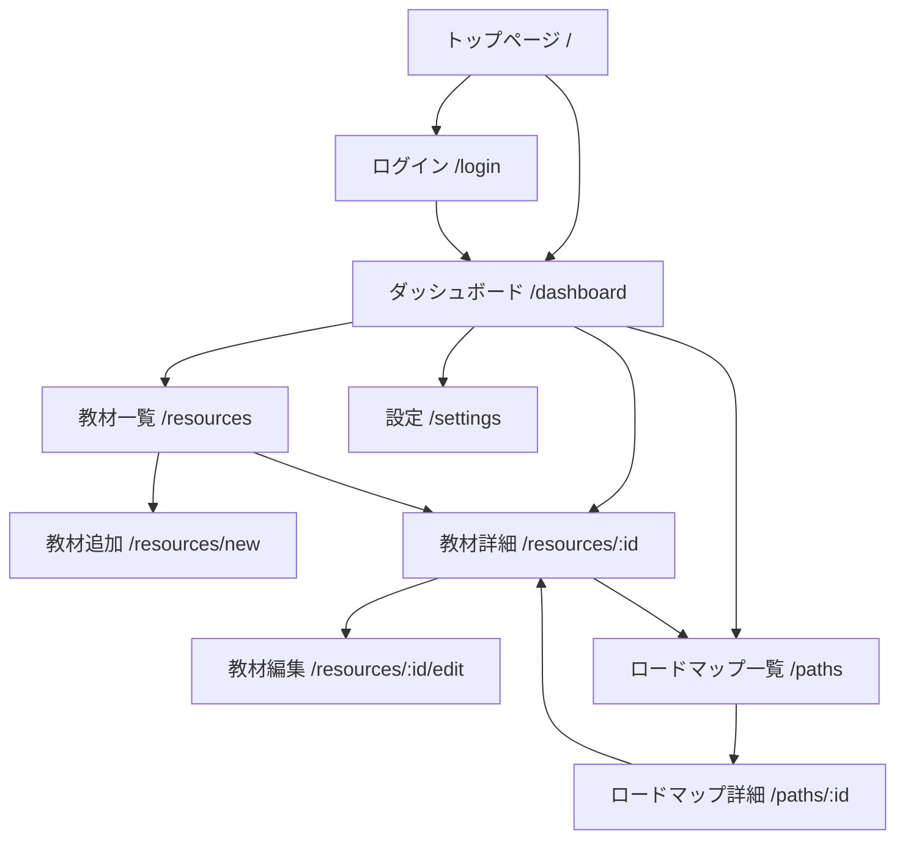

# CourseTracker

CourseTracker は、技術学習に使う公式 Docs、公式 GitHub、動画、書籍、記事を一元管理するための学習ダッシュボードです。  
公開用ポートフォリオとして安全に見せられる題材を前提に、教材管理、学習ロードマップ、学習ログの拡張を見据えて実装しています。

## デモURL

- https://course-tracker-vert.vercel.app/

## 概要

- 学習教材を一つの画面群で整理するための Web アプリです。
- 教材一覧、教材詳細、学習メモ、学習ログ、学習ロードマップ、ダッシュボードをユーザー単位で管理できます。
- 公開用ポートフォリオとして、公式 Docs や公式 GitHub を安全に扱える題材に絞っています。

## 現在できること

- GitHub OAuth を使ったログイン
- ログイン済みユーザー向けの保護ページ
- ダッシュボードでの学習状況の俯瞰
- 教材の登録、一覧表示、詳細表示、編集
- タグ、学習メモ、学習ログの記録
- 学習ロードマップの作成、教材追加、順序管理
- モバイル幅を考慮した主要導線の表示

## 技術スタック

- フレームワーク: Next.js
- 言語: TypeScript
- UI: Tailwind CSS
- 認証: Auth.js
- ORM: Prisma
- データベース: PostgreSQL
- ローカル DB: Docker Compose
- パッケージマネージャー: pnpm

## スクリーンショット

スクリーンショットは今後差し替え予定です。配置先のプレースホルダーとして [docs/screenshots/README.md](docs/screenshots/README.md) を用意しています。

- トップページ: 準備中
- ダッシュボード: 準備中
- 教材一覧: 準備中
- 教材詳細: 準備中
- ロードマップ一覧: 準備中
- ロードマップ詳細: 準備中

差し替え時の想定ファイル:

- `docs/screenshots/top-page.png`
- `docs/screenshots/dashboard.png`
- `docs/screenshots/resources.png`
- `docs/screenshots/resource-detail.png`
- `docs/screenshots/paths.png`
- `docs/screenshots/path-detail.png`

## アーキテクチャ概要

CourseTracker は Next.js App Router を土台にしたフルスタック構成です。画面、認証、Server Actions、Prisma を同一リポジトリ内で閉じ、学習データをユーザー単位で安全に扱うことを優先しています。



構成上の役割:

- `src/app`: App Router の画面、layout、loading、error、not-found
- `src/components`: 再利用 UI コンポーネント
- `src/lib`: Prisma 取得ロジック、フォーム schema、表示用メタデータ
- `src/auth.ts`: Auth.js 設定
- `prisma/schema.prisma`: データモデル
- `prisma/seed.mjs`: 公開デモ用 seed

## ローカルセットアップ

### 前提

- Node.js 20 以上
- pnpm 10 系
- Docker / Docker Compose
- GitHub OAuth App

### 1. 依存関係をインストール

```bash
pnpm install
```

### 2. 環境変数を設定

`.env.example` を元に `.env` を作成し、必要な値を設定します。

```bash
cp .env.example .env
```

設定が必要な主な環境変数:

- `DATABASE_URL`
- `AUTH_SECRET`
- `AUTH_GITHUB_ID`
- `AUTH_GITHUB_SECRET`
- `POSTGRES_USER`
- `POSTGRES_PASSWORD`
- `POSTGRES_DB`
- `POSTGRES_PORT`

GitHub OAuth App の callback URL は次を想定しています。

```txt
http://localhost:3000/api/auth/callback/github
```

### 3. PostgreSQL を起動

```bash
pnpm db:up
pnpm db:check
```

### 4. Prisma を反映

```bash
pnpm prisma:generate
pnpm prisma:migrate
```

### 5. 開発サーバーを起動

```bash
pnpm dev
```

起動後は `http://localhost:3000` を開いて動作を確認します。

### 6. 公開用 seed データを投入

公開デモ用の安全な教材データを投入できます。内容は公式 Docs と公式 GitHub のみで、個人情報に関する情報は含みません。

```bash
pnpm prisma:seed
```

デフォルトでは `demo@coursetracker.local` という公開用デモユーザーに対して、教材、タグ、メモ、学習ログ、ロードマップを投入します。

ローカルで GitHub ログインした自分のユーザーにサンプルデータを入れたい場合は、ログインに使っているメールアドレスを指定して実行します。

```bash
SEED_USER_EMAIL=your-github-email@example.com pnpm prisma:seed
```

必要に応じて表示名も変えられます。

```bash
SEED_USER_EMAIL=your-github-email@example.com SEED_USER_NAME="Local Demo User" pnpm prisma:seed
```

seed の内容:

- 公式 Docs / 公式 GitHub を中心にしたサンプル教材
- タグ、学習メモ、学習ログ
- 進捗が見える 2 本の学習ロードマップ
- ダッシュボード、教材一覧、教材詳細、ロードマップ一覧・詳細が成立する状態

## 開発コマンド

```bash
pnpm dev
pnpm lint
pnpm build
pnpm db:up
pnpm db:down
pnpm prisma:generate
pnpm prisma:migrate
pnpm prisma:seed
```

## ディレクトリの要点

- `src/app`: App Router の画面とレイアウト
- `src/app/(app)`: ログイン済みユーザー向けの共通レイアウト配下
- `src/auth.ts`: Auth.js 設定
- `prisma/schema.prisma`: Prisma スキーマ
- `docker-compose.yml`: ローカル PostgreSQL の起動設定

## ER図

現時点のデータモデルをもとにした論理 ER 図です。



補足:

- `LearningResource` は中心モデルで、教材 URL はユーザー単位で一意です。
- `Tag` はユーザー単位で管理し、`ResourceTag` で教材と多対多に紐づきます。
- `Note` と `StudyLog` は教材詳細画面から直接追加できるよう、`LearningResource` に紐づけています。
- `LearningPathItem` は `LearningResource` を必須参照し、ロードマップと教材一覧を一貫して扱います。

## 画面遷移図

主要画面の流れを Mermaid で整理しています。公開ポートフォリオとして見せる範囲に絞り、主要導線だけを記載しています。



画面ごとの役割:

- `ダッシュボード`: 学習中教材、高優先度教材、今週更新、ステータス集計、種別集計を表示
- `教材一覧`: 絞り込みと状態更新をしながら教材を探す
- `教材詳細`: 基本情報、学習状態、メモ、学習ログ、関連ロードマップを集約
- `ロードマップ一覧`: 学習テーマごとのまとまりを確認し、新規作成する
- `ロードマップ詳細`: 教材の順序、進捗、追加導線を管理する

## 主要な設計判断

- 認証は `Auth.js + GitHub OAuth` に限定しています。
  - 公開用ポートフォリオとして導線を絞り、資格情報管理を増やしすぎないためです。
- 中心モデルを `LearningResource` にしています。
  - メモ、学習ログ、ロードマップのすべてが教材を起点に拡張できる構造にするためです。
- URL は `LearningResource` で `userId + url` を一意にしています。
  - 同じユーザーが同じ教材を重複登録しにくくするためです。
- 学習ログは `studyMinutes` と `understandingNote` を分離しています。
  - 後続で集計しやすい数値と、理解メモとして読むテキストを分けるためです。
- ロードマップ内の順序は `LearningPathItem.position` で保持しています。
  - ドラッグ&ドロップなしでも、DB 上で明示的に順序管理できるようにするためです。
- データ取得は `src/lib` に寄せ、画面側では表示に集中させています。
  - App Router のページや Server Actions の責務を読みやすく保つためです。

## 今後追加予定の機能

- スクリーンショット差し替えと README の仕上げ
- ダッシュボードの追加集計
- ロードマップの編集と削除
- 設定画面の具体化
- テストの拡充

## 補足

- 本リポジトリは公開用ポートフォリオを前提にしているため、個人情報は扱いません。
- 本番デプロイ、詳細設計図、完成版スクリーンショットは今後追加予定です。
